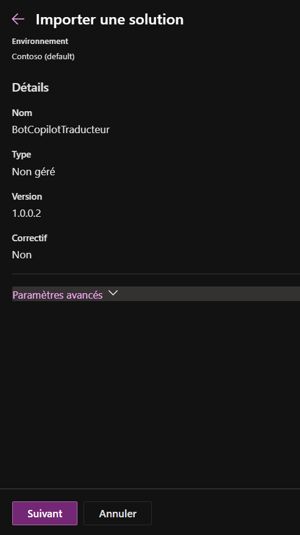
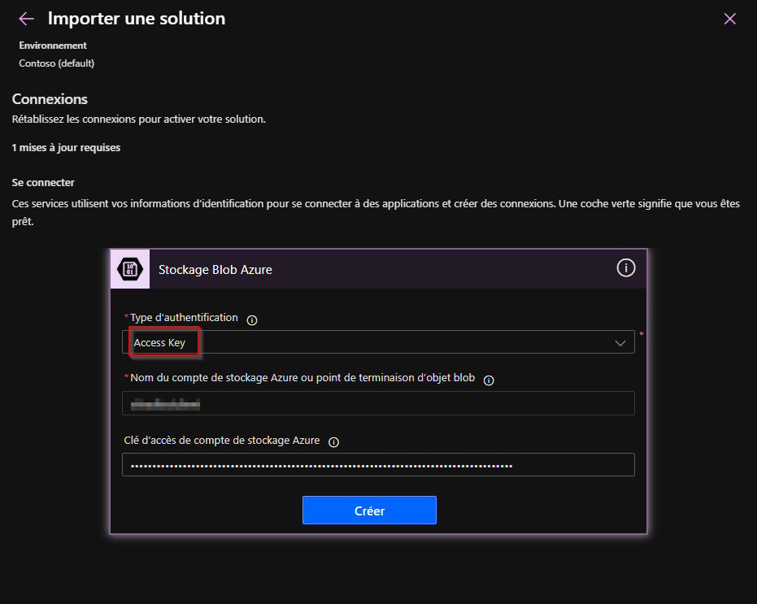
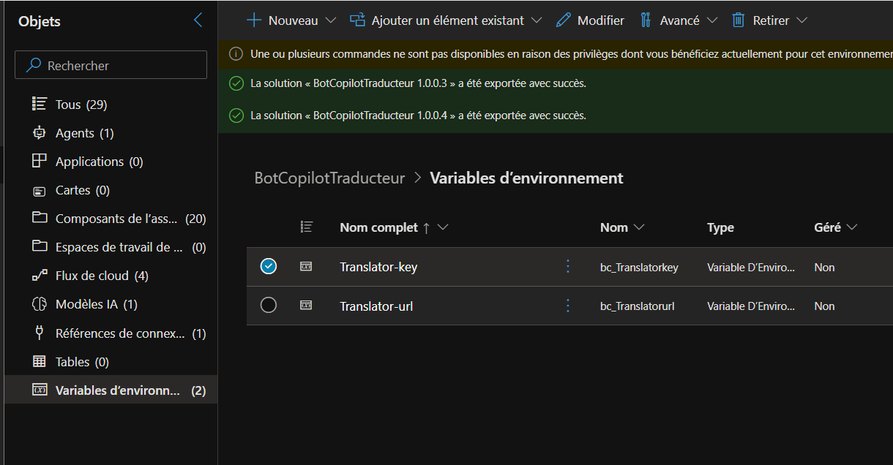

# 🤖 Guide Complet - Déploiement Power Platform Bot Traducteur

## 📋 Vue d'ensemble

Ce guide détaille le déploiement de la solution Power Platform Bot Traducteur avec toutes les étapes corrigées et validées.

**Durée estimée** : 30-40 minutes  
**Prérequis** : Azure Function déployée, licences Power Apps/Copilot Studio

---

## 🔑 Informations Requises

Avant de commencer, ayez sous la main :

### Depuis le déploiement Azure
- ✅ **Nom du Storage Account** : `sttradtestclient`
- ✅ **Clé du Storage Account** : (depuis deployment-*.json)
- ✅ **Translator Key** : clé de la fonction déployée
- ✅ **Translator Endpoint** : url de la fonction déployée

### Fichiers nécessaires
- ✅ **Solution** : `Solution/BotCopilotTraducteur_xxxx.zip`
---

## 🚀 Déploiement Étape par Étape

### ÉTAPE 1 : Accéder à Copilot Studio

1. Ouvrir un navigateur
2. Aller sur : **https://copilotstudio.microsoft.com**
3. Se connecter avec le compte client
   - Compléter l'authentification MFA si demandée

4. Vérifier l'environnement en haut à droite
   - Si pas d'environnement avec Dataverse → Créer un environnement
   - Type recommandé : Production
   - Région : France ou Europe

---

### ÉTAPE 2 : Importer la Solution

#### 2.1 Accéder à l'import

**Option A (Recommandée) :**
1. Dans Copilot Studio, cliquer sur **"Solutions"** dans le menu de gauche
2. Cliquer sur **"Importer une solution"** en haut

**Option B :**
1. Cliquer sur **"Assistant"** dans le menu
2. Cliquer sur **"Importer l'assistant"**

#### 2.2 Sélectionner le fichier

1. Cliquer sur **"Parcourir"** ou **"Browse"**
2. Sélectionner : `BotCopilotTraducteur_xxxx.zip`
3. Cliquer sur **"Suivant"** / **"Next"**



---

### ÉTAPE 3 : Configuration pendant l'Import

⚠️ **IMPORTANT** : Pendant l'import, vous devrez configurer 2 choses :

#### 3.1 Connexion au Stockage Blob Azure

La solution utilise un connecteur Blob Azure pour gérer les documents.

1. Une fenêtre s'ouvrira demandant de créer une connexion
2. Renseigner les informations du Storage Account :


**Informations à fournir :**
```
Nom du compte de stockage : sttradtestclient
Clé d'accès au compte     : <STORAGE_KEY depuis deployment.json>
```



3. Cliquer sur **"Créer"** / **"Create"**
4. Tester la connexion (bouton "Tester")

#### 3.2 Variables d'Environnement

**Option A : Pendant l'import**

Si demandé pendant l'import, renseigner :

```
Translator-key : <TRANSLATOR_KEY>
Translator-url : <TRANSLATOR_URL>
```

**Option B : Après l'import**

Si vous n'avez pas renseigné pendant l'import :

1. Une fois l'import terminé, ouvrir la solution
2. Aller dans **"Variables d'environnement"**
3. Éditer chaque variable :
   - `Translator-key` → Valeur
   - `Translator-url` → Valeur



4. Cliquer sur **"Enregistrer"** pour chaque variable

---

### ÉTAPE 4 : Attendre la Fin de l'Import

1. L'import prend **2-5 minutes**
2. Vous verrez une barre de progression
3. Une notification confirmera la fin de l'import
4. La solution apparaîtra dans la liste

**En cas d'erreur :**
- Vérifier les credentials du Storage
- Vérifier les variables d'environnement
- Réessayer l'import

---

### ÉTAPE 5 : Ouvrir et Vérifier le Bot

1. Dans Copilot Studio, aller dans **"Assistants"** ou **"Bots"**
2. Ouvrir **"Bot Traducteur"** ou **"crf4a_assistant1"**

#### Vérifier les Topics

1. Aller dans **"Topics"**
2. Vérifier que les topics suivants sont présents :
   - ✅ `translate_document` (principal)
   - ✅ `Greeting`
   - ✅ `Goodbye`
   - ✅ `Escalate`
   - ✅ `EndofConversation`
   - ✅ `OnError`

#### Vérifier les Variables

1. Aller dans **"Variables"** (dans les paramètres du bot)
2. Vérifier que les variables suivantes sont configurées :
   - ✅ `Translator-key` : Doit avoir une valeur
   - ✅ `Translator-url` : Doit avoir une valeur

---

### ÉTAPE 6 : Tester le Bot

1. Cliquer sur **"Test"** en haut à droite
2. Le panneau de test s'ouvre sur la droite

#### Test 1 : Conversation de base

```
Vous: Bonjour
Bot: [Doit répondre avec un message de bienvenue]
```

#### Test 2 : Démarrer une traduction

```
Vous: Je veux traduire un document
Bot: [Doit demander le fichier à traduire]
```

1. Cliquer sur le bouton d'upload (📎)
2. Sélectionner un petit fichier texte de test
3. Le bot demande la langue cible
4. Choisir une langue (ex: "français" si fichier en anglais)
5. Le bot doit :
   - Confirmer la réception
   - Lancer la traduction
   - Fournir le résultat ou un lien de téléchargement

#### Test 3 : Vérifier les langues supportées

```
Vous: Quelles langues sont supportées ?
Bot: [Doit lister les langues ou donner un lien]
```

---

### ÉTAPE 7 : Vérifier les Workflows Power Automate

1. Aller sur **https://make.powerapps.com**
2. Sélectionner le même environnement
3. Aller dans **"Solutions"**
4. Ouvrir **"Bot Copilot Traducteur"**
5. Aller dans **"Flux cloud"** / **"Cloud flows"**

Vérifier que les flux suivants sont présents :
- ✅ `start-translation`
- ✅ `check_status`
- ✅ `get-translation-result`
- ✅ `cleaned-filename`

#### Tester un flux

1. Ouvrir `start-translation`
2. Cliquer sur **"Tester"** / **"Test"**
3. Choisir **"Manuellement"** / **"Manually"**
4. Fournir des données de test
5. Vérifier que le flux s'exécute sans erreur

---

### ÉTAPE 8 : Publier le Bot

1. Retourner dans Copilot Studio
2. Ouvrir le **Bot Traducteur**
3. Cliquer sur **"Publier"** en haut à droite
4. Confirmer la publication

**Temps de publication** : 2-3 minutes

---

### ÉTAPE 9 : Configurer les Canaux

#### Canal Demo Website (pour tester)

1. Aller dans **"Paramètres"** → **"Canaux"** / **"Channels"**
2. Activer **"Site web de démonstration"** / **"Demo website"**
3. Copier l'URL fournie
4. Tester dans un nouvel onglet

#### Canal Microsoft Teams (pour les utilisateurs)

1. Dans **"Canaux"**, activer **"Microsoft Teams"**
2. Cliquer sur **"Ouvrir le bot"**
3. Le bot s'ouvre dans Teams
4. Tester une conversation

**Partager avec les utilisateurs :**
1. Copier le lien du bot Teams
2. Partager avec les utilisateurs concernés
3. Ils pourront l'ajouter à Teams

#### Autres Canaux (optionnel)

- **Site web personnalisé** : Intégrer sur votre site
- **Application mobile** : Via Power Apps
- **Email** : Via Power Automate

---

## ✅ Checklist Post-Déploiement

### Vérifications Techniques

- [ ] Solution importée sans erreur
- [ ] Connexion Blob Azure créée et testée
- [ ] Variables d'environnement configurées
  - [ ] `Translator-key` renseignée
  - [ ] `Translator-url` renseignée
- [ ] Bot visible dans Copilot Studio
- [ ] Tous les topics présents
- [ ] Test conversation basique réussi
- [ ] Test traduction document réussi
- [ ] Workflows Power Automate visibles
- [ ] Bot publié
- [ ] Canal Demo website activé
- [ ] Canal Teams activé (si applicable)

### Vérifications Fonctionnelles

- [ ] Upload de document fonctionne
- [ ] Choix de langue fonctionne
- [ ] Traduction effectuée
- [ ] Téléchargement du résultat fonctionne
- [ ] Gestion des erreurs (fichier trop gros, format non supporté)

### Documentation et Formation

- [ ] URL du bot documentée
- [ ] Guides utilisateur préparés
- [ ] Formation des utilisateurs planifiée
- [ ] Support technique défini

---

## 🔧 Troubleshooting

### Erreur : "La connexion au stockage Blob a échoué"

**Cause** : Credentials Storage incorrects

**Solution** :
1. Vérifier le nom du Storage Account
2. Vérifier la clé (depuis deployment.json)
3. Recréer la connexion dans Power Apps
4. Retester

### Erreur : "Variables d'environnement manquantes"

**Cause** : Variables non configurées

**Solution** :
1. Ouvrir la solution dans Power Apps
2. Aller dans "Variables d'environnement"
3. Éditer chaque variable
4. Sauvegarder
5. Republier le bot

### Erreur : "Le bot ne répond pas"

**Cause** : Problème de publication ou d'environnement

**Solution** :
1. Vérifier que le bot est bien publié
2. Vider le cache du navigateur
3. Tester dans un navigateur privé
4. Vérifier les logs dans Power Automate

### Erreur : "La traduction échoue"

**Cause** : Problème avec l'API Azure ou les credentials

**Solutions** :
1. Vérifier que l'Azure Function fonctionne :
   ```bash
   curl https://func-translation-xxxx.azurewebsites.net/api/health
   ```
2. Vérifier la `Translator-key` dans les variables
3. Vérifier la `Translator-url`
4. Vérifier les logs Power Automate pour l'erreur exacte

### Erreur : "Environnement sans Dataverse"

**Cause** : Environnement ne supporte pas les solutions

**Solution** :
1. Créer un nouvel environnement :
   - Aller sur https://admin.powerplatform.microsoft.com
   - Environments → New
   - Activer Dataverse : Yes
   - Type : Production
2. Réimporter la solution dans ce nouvel environnement

---

## 📊 Informations Importantes

### Limites et Quotas

**Copilot Studio :**
- Nombre de conversations : Selon licence
- Messages par conversation : Illimité
- Taille fichier : Limité par Azure Function

**Power Automate :**
- Exécutions par jour : Selon licence (généralement 2000+)
- Timeout : 30 minutes par flux

**Azure Function :**
- Upload max : Configuré dans le code (généralement 100 MB)
- Quota Translator F0 : 2.5M caractères/mois

### Maintenance

**Mise à jour de la solution :**
1. Exporter la solution depuis l'environnement de dev
2. Importer dans l'environnement de prod
3. Choisir "Mise à jour" lors de l'import
4. Republier le bot

**Monitoring :**
- Logs Copilot Studio : Dans l'interface du bot
- Logs Power Automate : Historique des flux

---

## 📚 Ressources

### Documentation Microsoft

- Power Apps : https://learn.microsoft.com/power-apps
- Copilot Studio : https://learn.microsoft.com/microsoft-copilot-studio
- Power Automate : https://learn.microsoft.com/power-automate
- Azure Functions : https://learn.microsoft.com/azure/azure-functions

### Liens Utiles

- Power Apps : https://make.powerapps.com
- Copilot Studio : https://copilotstudio.microsoft.com
- Admin Center : https://admin.powerplatform.microsoft.com
- Azure Portal : https://portal.azure.com

---

## ✅ Validation Finale

Après avoir suivi toutes les étapes :

- ✅ Solution déployée et fonctionnelle
- ✅ Bot testé avec succès
- ✅ Traductions effectuées
- ✅ Utilisateurs formés
- ✅ Documentation complète

**🎉 Félicitations ! Le Bot Traducteur est déployé et opérationnel ! 🎉**

---

*Guide créé le : 2026-01-08*  
*Version : 1.1 - Corrigé avec étapes validées*  
*Solution : BotCopilotTraducteur_xxxx.zip*
